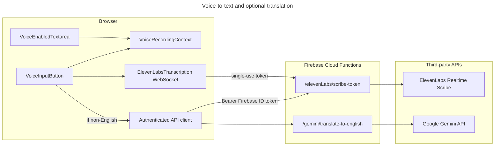

# AI Voice-to-Text Enhancement Features

## Overview

Care On Board supports **dictation into narrative fields** on selected DSP, agency, and documentation screens. Staff can speak instead of typing; the product **streams speech to text** in real time, optionally **translates non-English speech to English** before inserting the result into the active field, and does **not** expose third-party API keys in the browser for translation.

**Primary goals:**

- Reduce typing burden on long-form documentation (notes, incidents, goals, expenses).
- Keep **Gemini (translation) API keys on the server**; only **authenticated** users can request translation.
- Use **ElevenLabs** realtime speech-to-text with **language detection** so Accept can normalize text to English when appropriate.

This document is for **engineers, DevOps, and technical program staff** who need to operate, extend, or audit the feature.

---

## Table of contents

1. [End-user experience](#1-end-user-experience)
2. [Architecture (high level)](#2-architecture-high-level)
3. [Frontend components and context](#3-frontend-components-and-context)
4. [Backend endpoints and secrets](#4-backend-endpoints-and-secrets)
5. [Configuration and environment variables](#5-configuration-and-environment-variables)
6. [Security and privacy](#6-security-and-privacy)
7. [Screens and surfaces where voice is integrated](#7-screens-and-surfaces-where-voice-is-integrated)
8. [Adding voice to a new screen](#8-adding-voice-to-a-new-screen)
9. [Operations: Firebase / GCP](#9-operations-firebase--gcp)
10. [Troubleshooting](#10-troubleshooting)
11. [Key source files (reference)](#11-key-source-files-reference)

---

## 1. End-user experience

### Starting dictation

1. On a supported page, the user focuses a **voice-enabled** field. A **microphone control** appears (typically on hover over a narrative `VoiceEnabledTextarea`).
2. The user clicks the mic to **start recording**. The app requests microphone permission if needed.
3. While speaking, **partial** and **committed** transcript segments update in the **floating recording panel** (`VoiceInputButton`), which appears fixed near the bottom of the viewport when recording is active.
4. The UI can show **detected language** when the STT service provides it.

### Accepting the transcript

- The user clicks **Accept** on the floating panel to **replace** the bound field’s value with the final transcript (after any translation step—see below).
- The user can **cancel** recording without applying text (behavior is defined in `VoiceInputButton` and the recording context).

### Translation to English (server-side)

- If the **detected language** is not English (normalized to a base language code such as `en`), the client calls a **Cloud Function** that uses **Google Gemini** to translate the transcript to English **before** writing it into the field.
- If translation fails, the product surfaces an error (e.g. toast) and can fall back to the **original** transcript text where implemented—see `VoiceInputButton` and `translation.ts`.

### Read-only and gated UIs

- Some agency note views only allow voice when the submission is **editable** (e.g. submitted note in a state that allows edits). **Read-only** modes use plain disabled text areas **without** the per-field mic affordance.

---

## 2. Architecture (high level)

**Data flow summary:**

| Step | What happens |
|------|----------------|
| 1 | User starts recording from `VoiceEnabledTextarea`; context stores active field callbacks. |
| 2 | `VoiceInputButton` mounts `ElevenLabsTranscription`, which calls **`GET /elevenLabs/scribe-token`** with the user’s Firebase ID token. |
| 3 | Browser opens a **WebSocket** to ElevenLabs using the token and optional **`VITE_ELEVENLABS_WS_ORIGIN`**. |
| 4 | Partial/committed text and language hints flow into React state. |
| 5 | On **Accept**, if language ≠ English, **`POST /gemini/translate-to-english`** runs; response text is applied to the field. |
| 6 | Otherwise the transcript is applied directly. |

---

## 3. Frontend components and context

### `VoiceRecordingProvider` (`src/contexts/VoiceRecordingContext.tsx`)

- Wraps a **page or modal** subtree that participates in voice input.
- Accepts optional **`pageTitle`** used as a default label for analytics/context when a field does not pass its own title.
- Exposes **`useVoiceRecording()`** with:
  - `startRecording`, `stopRecording`, `isRecording`
  - transcript buffers (`partialTranscript`, `committedTranscripts`)
  - `detectedLanguage`, `setDetectedLanguage`
  - callbacks for wiring STT (`addCommittedTranscript`, etc.)

**Rule:** Any component that calls `useVoiceRecording()` (including `VoiceEnabledTextarea` and `VoiceInputButton`) must be **descendants** of `VoiceRecordingProvider`.

### `VoiceEnabledTextarea` (`src/components/VoiceEnabledTextarea.tsx`)

- Renders a standard UI **`Textarea`** plus an overlay **mic** button (shown on hover unless disabled).
- On mic click, calls `startRecording(fieldName, pageTitle, …)` and registers **`onAccept`** to update the field via `onChange(transcript)`.
- Props: `value`, `onChange`, `className`, `placeholder`, `fieldName`, `pageTitle`, `disabled`.

### `VoiceInputButton` (`src/components/VoiceInputButton.tsx`)

- While **not** recording, renders **nothing** (`null`)—it is still mounted so the subtree can mount STT when recording starts.
- When recording, shows the **floating card**: connection status, language, waveform, **Accept**, cancel/stop, and embeds **`ElevenLabsTranscription`**.
- On **Accept**, may call **`translateToEnglish`** from `src/lib/translation.ts` when `shouldTranslateToEnglish(detectedLanguage)` is true.
- Optional props: `onClick`, `onAccept`, `className` (merged onto the fixed container—used e.g. for **`z-[60]`** inside modals).

### `ElevenLabsTranscription` (`src/components/transcription/ElevenLabsTranscription.tsx`)

- Manages WebSocket session to ElevenLabs Scribe realtime API.
- Uses **`getScribeToken()`** from `src/lib/api/elevenlabs.ts`.

### Translation helper (`src/lib/translation.ts`)

- **`shouldTranslateToEnglish(detectedLanguage)`** — returns false for English or missing language.
- **`translateToEnglish(text, sourceLanguage?)`** — delegates to **`translateToEnglishViaApi`** in `src/lib/api/gemini.ts` (no client-side Gemini SDK).

---

## 4. Backend endpoints and secrets

### ElevenLabs scribe token

- **Function export:** `elevenLabs` (user-panel routes bundle in backend repo).
- **Route:** `GET .../elevenLabs/scribe-token`
- **Auth:** Firebase Auth via shared **`verifyToken`** middleware.
- **Secret:** `ELEVENLABS_API_KEY` (Secret Manager / function `secrets` binding).
- **Purpose:** Returns a **single-use** token for realtime Scribe WebSocket connections.

### Gemini translation

- **Function export:** `gemini` (shared routes—usable by any panel sharing the same API base URL and auth).
- **Route:** `POST .../gemini/translate-to-english`
- **Body:** `{ text: string, sourceLanguage?: string }`
- **Validation:** Non-empty `text`, maximum length cap (e.g. 20,000 characters) to limit abuse.
- **Auth:** Firebase Auth **`verifyToken`**.
- **Secrets / params:**
  - **`GEMINI_API_KEY`** — `defineSecret`, bound to the `gemini` function.
  - **`GEMINI_TRANSLATION_MODEL`** — optional `defineString` with a documented default model id (overridable per environment).
- **Response:** `{ translatedText: string }`
- **Implementation file (backend):** `functions/routes/shared-routes/gemini.js` (official **`@google/genai`** SDK).

### Logging

- Translation requests are logged via shared **`logAction`** with category such as **`gemini`**, including lengths and status—not full user transcripts in success paths (see implementation for exact fields).

---

## 5. Configuration and environment variables

### React app (`Care-On-Board`)

| Variable | Purpose |
|----------|---------|
| `VITE_API_BASE_URL` | Base URL for Cloud Functions (must include path prefix used elsewhere, e.g. `/elevenLabs/...`, `/gemini/...`). |
| `VITE_ELEVENLABS_WS_ORIGIN` | WebSocket origin for ElevenLabs realtime (e.g. `wss://api.elevenlabs.io`). **Not** the API key. |

**Removed / not used for translation:**

- Do **not** set `VITE_GEMINI_API_KEY` or client-side Gemini model env vars; translation runs only through **`/gemini/translate-to-english`**.

### Cloud Functions (`CareOnBoard-BackEnd/functions`)

| Secret / param | Purpose |
|----------------|---------|
| `GEMINI_API_KEY` | Google AI / Gemini API key (Secret Manager). |
| `GEMINI_TRANSLATION_MODEL` | Optional deploy-time model id string parameter. |
| `ELEVENLABS_API_KEY` | Server-side key for minting Scribe tokens. |

Local emulator: follow team conventions (e.g. `functions/.secret.local` or documented secret setup) so `GEMINI_API_KEY` and `ELEVENLABS_API_KEY` resolve at runtime.

---

## 6. Security and privacy

- **Translation:** API key stays **server-side**; browser only sends **Bearer token** + text to your own Cloud Function.
- **STT token:** Short-lived; minted only for **authenticated** users; ElevenLabs key never sent to the client.
- **Abuse limiting:** Translation route enforces a **maximum input length**; rate limiting may be layered at API gateway / Firebase level per org policy.
- **Microphone:** Requires user consent; failures should be handled in UI (permission denied, insecure context, etc.—see transcription component).
- **Logging:** Avoid logging full PHI in application logs; current Gemini route logs **metadata** (lengths, model, errors) rather than full narrative content in structured logs.

---

## 7. Screens and surfaces where voice is integrated

The table below reflects the **React** codebase integration pattern: **`VoiceRecordingProvider`** scope, **`VoiceEnabledTextarea`** on narrative fields where applicable, and **`VoiceInputButton`** mounted when editing is allowed.

| Area | Location (representative path) | Notes |
|------|--------------------------------|-------|
| **DSP — Respite log** | `src/pages/userPanel/notes/respite-log/index.tsx` | Multiple `VoiceEnabledTextarea` fields; `VoiceInputButton`. |
| **DSP — Supported employment (pre)** | `src/pages/userPanel/notes/supported-employment-pre/index.tsx` | Provider + `VoiceInputButton` (template-specific fields). |
| **DSP — Supported employment intervention** | `src/pages/userPanel/notes/supported-employment-intervention/index.tsx` | `VoiceEnabledTextarea` + `VoiceInputButton`. |
| **DSP — Community based** | `src/pages/userPanel/notes/community-based/index.tsx` | Provider + `VoiceInputButton` (field widgets per template). |
| **DSP — Incident report** | `src/pages/userPanel/incident/index.tsx` | Three narrative `VoiceEnabledTextarea` fields; `VoiceInputButton`. |
| **DSP — Expenses** | `src/pages/userPanel/expenses/index.tsx` | Expense message `VoiceEnabledTextarea`; `VoiceInputButton`. |
| **Agency — Respite log** | `src/pages/agency/notes/components/respiteLog.tsx` | Same pattern as DSP respite when editable. |
| **Agency — Community based** | `src/pages/agency/notes/components/commnityBased.tsx` | Gated `VoiceInputButton` when note is submitted/editable per product rules. |
| **Agency — Activities log** | `src/pages/agency/notes/components/activitiesLogTemplate.tsx` | Gated `VoiceInputButton`. |
| **Agency — Supported employment intervention** | `src/pages/agency/notes/components/supportedEmploymentIntervention.tsx` | `VoiceEnabledTextarea` + gated `VoiceInputButton`. |
| **Agency — Incident detail modal** | `src/pages/agency/incident/components/IncidentDetailModal.tsx` | Provider on modal panel; reviewer `VoiceEnabledTextarea` fields; `VoiceInputButton` with raised z-index when reviewer can act. |
| **Staff documentation — Annual update** | `src/pages/agency/goalsAndDocuments/components/AnnualUpdateTemplate.tsx` | Eight narrative `VoiceEnabledTextarea` fields when not read-only; `VoiceInputButton`. |
| **Staff documentation — Natural supports training** | `src/pages/agency/goalsAndDocuments/NaturalSupportsTraining.tsx` | Per-training-row description `VoiceEnabledTextarea`; `VoiceInputButton`. |
| **Shared activities template** | `src/components/ActivitiesLogTemplate.tsx` | Provider + `VoiceInputButton` for embedded note flows. |
| **Goals template** | `src/pages/agency/goalsAndDocuments/components/IndividualizedGoalsTemplate.tsx` | `VoiceRecordingProvider` only (extend here if narrative fields should gain mics). |

**Convention:** Outer layout often adds **`pb-20`** (or similar) so the fixed recording card does not cover primary actions.

---

## 8. Adding voice to a new screen

1. **Wrap** the page or modal content in **`VoiceRecordingProvider`** with a stable **`pageTitle`** string.
2. Replace narrative **`Textarea`** elements with **`VoiceEnabledTextarea`**, passing:
   - controlled **`value`** / **`onChange`**
   - **`fieldName`** (short, unique per field for support/debug)
   - **`pageTitle`** consistent with the provider (or override per field if needed)
3. Mount **`VoiceInputButton`** once inside the provider subtree, typically **after** the main form, when the user is allowed to dictate (mirror **`respiteLog.tsx`** or **`userPanel/incident/index.tsx`**).
4. For **read-only** views, render a **disabled** plain textarea (or `Textarea` with `readOnly`/`disabled`) **without** `VoiceEnabledTextarea` so the mic does not appear.
5. **Modals:** Ensure the recording UI stacks above the overlay (e.g. **`className="z-[60]"`** on `VoiceInputButton`); modal panel may need **`relative z-[51]`** and inner **`pb-20`**.
6. **Do not** add client Gemini keys; use **`translateToEnglish`** from `src/lib/translation.ts` only (already used from `VoiceInputButton`).

---

## 9. Operations: Firebase / GCP

### Deploying translation

1. Create **`GEMINI_API_KEY`** in Secret Manager (or use Firebase CLI secret set workflow aligned with `ELEVENLABS_API_KEY`).
2. Deploy the **`gemini`** function so **`secrets: [geminiApiKey]`** binding is active.
3. Optionally set **`GEMINI_TRANSLATION_MODEL`** via Functions params / `.env` as per `firebase-functions` `defineString` behavior.

### Deploying STT token route

- Ensure **`elevenLabs`** function has **`ELEVENLABS_API_KEY`** secret bound (existing pattern in `user-panel-routes`).

### Verifying end-to-end

- From the app, open a voice-enabled screen, start recording, speak a short phrase, Accept.
- Confirm network calls to **`/elevenLabs/scribe-token`** and, when language is non-English, **`/gemini/translate-to-english`** return **200** and the field updates.

---

## 10. Troubleshooting

| Symptom | Things to check |
|---------|------------------|
| Mic does nothing / no recording UI | Provider missing; `VoiceInputButton` not mounted; `useVoiceRecording` used outside provider. |
| STT fails immediately | `VITE_API_BASE_URL` wrong; user not authenticated; **`/elevenLabs/scribe-token`** errors; emulator secrets unset; CORS on Functions. |
| WebSocket errors | `VITE_ELEVENLABS_WS_ORIGIN` incorrect for region/product; token expired; corporate proxy blocking `wss`. |
| Translation never runs | Language detected as English; `shouldTranslateToEnglish` false; or **`/gemini`** not deployed / **401** / **502** from Gemini. |
| Translation errors | **`GEMINI_API_KEY`** missing on function; model id invalid; input over max length; Gemini outage. |
| Recording UI behind modal | Add **`z-index`** to `VoiceInputButton` `className`; raise modal content stacking context. |
| Field not updating on Accept | `VoiceEnabledTextarea` `onChange` not wired; recording stopped before Accept; error swallowed—check toast/console. |

---

## 11. Key source files (reference)

### Frontend (`Care-On-Board`)

| File | Role |
|------|------|
| `src/contexts/VoiceRecordingContext.tsx` | Provider and recording state. |
| `src/components/VoiceEnabledTextarea.tsx` | Mic + textarea field. |
| `src/components/VoiceInputButton.tsx` | Floating STT UI, Accept, translation on Accept. |
| `src/components/transcription/ElevenLabsTranscription.tsx` | WebSocket client for ElevenLabs. |
| `src/lib/api/elevenlabs.ts` | `getScribeToken()`. |
| `src/lib/api/gemini.ts` | `translateToEnglishViaApi()`. |
| `src/lib/translation.ts` | `shouldTranslateToEnglish`, `translateToEnglish`. |

### Backend (`CareOnBoard-BackEnd`)

| File | Role |
|------|------|
| `functions/routes/shared-routes/gemini.js` | `POST /translate-to-english` router. |
| `functions/routes/shared-routes/routes.js` | `exports.gemini` with secrets + CORS. |
| `functions/routes/user-panel-routes/elevenlabs.js` | Scribe token route. |
| `functions/index.js` | Re-exports `gemini` and other functions. |

### Ancillary

| File | Role |
|------|------|
| `src/hooks/useVoiceInput.ts` | Optional hook pattern (verify current usage before relying on it). |

---

## Document history

- **Initial version:** Documents server-side Gemini translation, ElevenLabs realtime STT, provider/textarea/button integration, and screen inventory as implemented in the Care On Board monorepo layout described above.

For workflow context across the wider product, see **`docs/care-on-board-workflow-guide.md`**.
