# CareOnboard: Process and Workflow Guide

**Purpose:** This document describes how major processes work in CareOnboard—for applicants, caregivers (DSPs), agency office staff, and (in one section) the team that first sets up an agency on the platform. It is intended for \*\*program managers, billing staff, trainers, quality staff, and

**Scope:** The guide reflects the product workflows documented for internal use.

## Table of contents

1. [High-level: user roles and post-login routing](#1-high-level-user-roles-and-post-login-routing)
2. [Applicant account onboarding (first-time signup)](#2-applicant-account-onboarding-first-time-signup)
3. [Job application process (applicant)](#3-job-application-process-applicant)
4. [Agency onboarding (Super Admin creates an agency)](#4-agency-onboarding-super-admin-creates-an-agency)
5. [Client onboarding (add / edit client)](#5-client-onboarding-add--edit-client)
6. [Agency-side applicant hiring (directory and profile)](#6-agency-side-applicant-hiring-directory-and-profile)
7. [Agency shift creation (Add new Schedule)](#7-agency-shift-creation-add-new-schedule)
8. [DSP when a shift is assigned (user panel shift management)](#8-dsp-when-a-shift-is-assigned-user-panel-shift-management)
9. [DSP documentation notes (activity logs)](#9-dsp-documentation-notes-activity-logs)
10. [Agency reports and billing](#10-agency-reports-and-billing)
11. [Agency staff management (Team)](#11-agency-staff-management-team)
12. [DSP Management (caregiver roster)](#12-dsp-management-caregiver-roster)
13. [Agency scheduling operations (lists, activity, approvals)](#13-agency-scheduling-operations-lists-activity-approvals)
14. [Agency Notes (review DSP documentation)](#14-agency-notes-review-dsp-documentation)
15. [Goals and Documents](#15-goals-and-documents)
16. [Mileage (DSP and agency)](#16-mileage-dsp-and-agency)
17. [Expenses (DSP submit and agency approval)](#17-expenses-dsp-submit-and-agency-approval)
18. [Incidents (DSP report and agency inbox)](#18-incidents-dsp-report-and-agency-inbox)

### Quick glossary

| Term                     | Meaning                                                                                                     |
| ------------------------ | ----------------------------------------------------------------------------------------------------------- |
| **Applicant**            | Someone applying to work for the agency through the hiring flow.                                            |
| **DSP**                  | Direct Support Professional—the caregiver who provides services and uses the employee (caregiver) app area. |
| **Agency staff**         | Office users who log into the agency dashboard with permissions chosen by the agency.                       |
| **Shift**                | A scheduled visit or block of work tied to a client and usually a DSP.                                      |
| **Activity log / notes** | Structured visit documentation the DSP completes for billing and quality.                                   |
| **EVV**                  | Electronic Visit Verification—rules and settings about how visits are verified for funding.                 |
| **OTP**                  | One-time passcode sent by email to verify identity.                                                         |

---

## How this guide is organized

The sections below follow the **same order as the table of contents**. Each section explains **what happens** in plain language, then includes a **diagram** you can use in training or handouts. Where you see “the app” or “the system,” that means CareOnboard.

---

## 1. High-level: user roles and post-login routing

After a successful **sign-in**, the app loads the person’s profile and sends them to the right **home area** based on their **role**. **Applicants** who have not finished account onboarding are sent to **onboarding** first instead of the applicant dashboard.

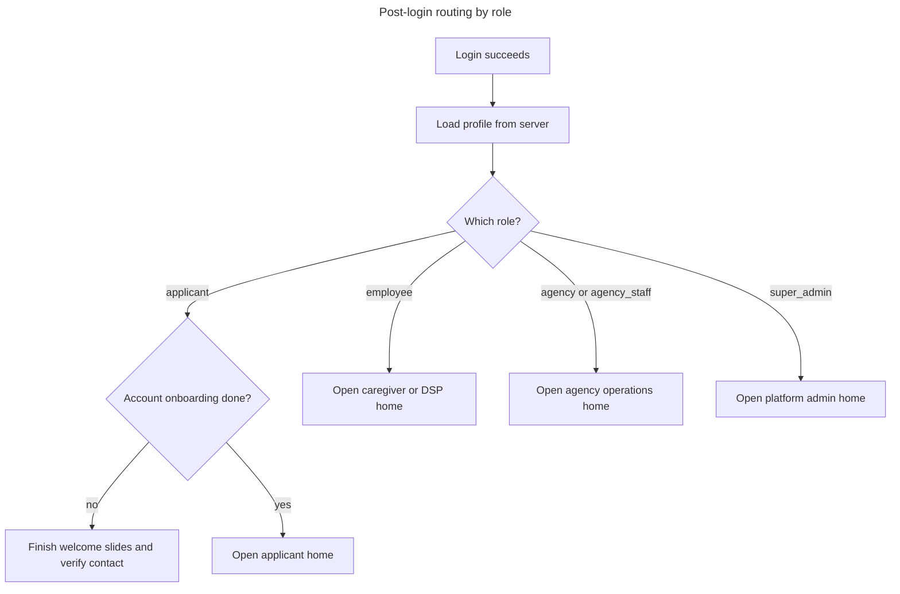

---

## 2. Applicant account onboarding (first-time signup)

**Purpose:** Intro slides, then email and OTP verification before the applicant reaches the dashboard.

**Typical path through the screens:** sign up → welcome slides → email step → enter the code (OTP) that was sent → success message → applicant home.

**What happens at each stage:**

- **Sign up:** After the account is created, the applicant is taken to onboarding.
- **Welcome slides:** Short informational screens; when finished, the applicant is guided to verify their email.
- **Verify email:** The system sends a one-time code to the inbox, then the applicant enters it on the next screen.
- **Enter code:** The code is checked; when it is correct, a success screen appears.
- **Success:** The applicant continues to the applicant home (dashboard).

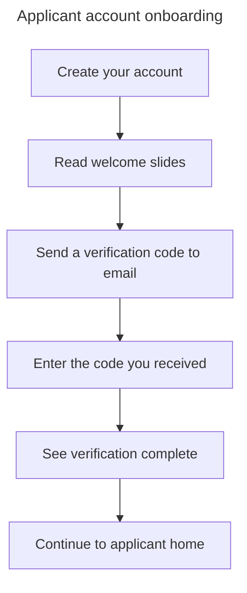

---

## 3. Job application process (applicant)

The applicant uses a single **Application** page with clear **steps** and progress. After each major step is completed successfully, the app advances. The applicant may **cancel** the application and return to the dashboard.

**The five stages (what the applicant sees):**

| Step | What it is called on screen                |
| ---: | ------------------------------------------ |
|    1 | Profile & Pre-Screening                    |
|    2 | Document Upload & Eligibility Verification |
|    3 | Conditional Hire & Compliance              |
|    4 | Final Agency Review                        |
|    5 | Official Hire & Orientation                |

**Status in the system (for staff who look up records):** The application moves through states such as incomplete, documents in progress, submitted for review, approved, or rejected. Exact labels in your admin tools may vary slightly.

---

### Step 1 — Profile & Pre-Screening

**What the applicant must provide:**

- **Identity:** Full name, email, date of birth, gender (Male or Female).
- **Address:** Street, city, ZIP; optional map-backed autocomplete.
- **Screening questions (Yes/No):** At least 18; high school diploma or GED; legally eligible to work in the U.S.; disqualifying offense under NJ law; reliable transportation.
- **Resume:** Optional; if a file is chosen it is uploaded first, then the URL is sent with pre-screening data.
- **Declaration:** Checkbox that the information is correct (required).

**Saving:** When the applicant completes this block, the app saves the information, shows a success message, and moves the stepper forward.

---

### Step 2 — Document upload & eligibility verification

**Documents:**

- Photo ID, SSN or work permit, diploma — **if uploaded, expiry date required** for those types.
- Optional certifications; Hepatitis B vaccination or chest x-ray; Hepatitis B titer; TB test; **I-9** and **W-4** (filled forms re-uploaded).
- Allowed file types include PDF and common image formats.

**References:** Two professional references (name, relationship, phone; email in UI).

**Declaration:** Checkbox that all information is correct.

**Saving:** Documents and eligibility information are saved as a package; the agency may need to review before the applicant can continue.

**Advancing:** User saves until the server moves them past eligibility; then **Next** appears without another save when the application step is already compliance, review, or orientation.

---

### Step 3 — Conditional hire & compliance

**Conditional hire:** Read letter, sign electronically, or go back to documents if declining.

**Compliance:** Enable every screening authorization, accept policy acknowledgments, confirm file accuracy again; submit to finalize.

---

### Step 4 — Final agency review

Read-only checklist from the server; **Next** only when every item is confirmed by the agency.

---

### Step 5 — Official hire & orientation

Official-hire signature, submit official hire, refresh profile, employee login details modal. Button labels follow signature and completion state.

---

### Job application — requirements in the flow diagram

**Rendering note:** Use stacked nodes (no HTML in labels) so diagrams render cleanly in common Mermaid previews.

**Main pipeline — stacked steps**

```mermaid
---
title: Job application — applicant pipeline
---
flowchart TD
  subgraph g1[1 Profile and screening]
    direction TB
    g1a[Collect name email DOB gender and address]
    g1b[Answer five Yes or No eligibility questions]
    g1c[Optionally attach a resume]
    g1d[Confirm your information is accurate]
    g1a --> g1b --> g1c --> g1d
  end
  subgraph g2[2 Documents and eligibility]
    direction TB
    g2a[Upload ID diploma SSN work authorization and certs]
    g2b[Add health TB Hep B I-9 and W-4 with dates where required]
    g2c[List two references and declare the packet is true]
    g2d[Wait for agency review then continue when cleared]
    g2a --> g2b --> g2c --> g2d
  end
  subgraph g3a[3a Conditional offer]
    direction TB
    h1[Read the conditional hire letter]
    h2[Sign electronically or go back to documents if you decline]
    h1 --> h2
  end
  subgraph g3b[3b Compliance]
    direction TB
    i1[Turn on every required screening authorization]
    i2[Accept training and policy acknowledgments]
    i3[Confirm once more that your file is accurate]
    i1 --> i2 --> i3
  end
  subgraph g4[4 Final agency review]
    direction TB
    j1[Watch checklist items until each is confirmed]
    j2[Continue only when the whole list is complete]
    j1 --> j2
  end
  subgraph g5[5 Official hire]
    direction TB
    k1[Sign the official hire packet]
    k2[Refresh your account and collect employee login info]
    k1 --> k2
  end
  g1d --> g2a
  g2d --> h1
  h2 --> i1
  i3 --> j1
  j2 --> k1
```

**Inside step 3 only**

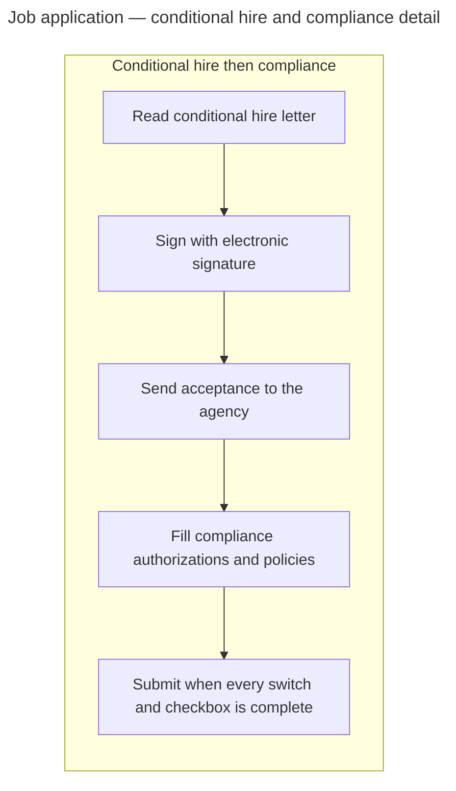

Applicants can **cancel** the application from the application page, returning to the dashboard.

---

## 4. Agency onboarding (Super Admin creates an agency)

**Purpose:** Provision a new agency and its default admin from the Super Admin area.

**Wizard:** Multi-step flow with optional draft save.

**Steps:**

1. Agency Identity Information
2. Leadership & Admin Contacts (default admin user and services)
3. Operational Settings
4. AI Settings & Permissions
5. Branding Setup
6. Billing Configuration
7. Subscription & Licensing Setup

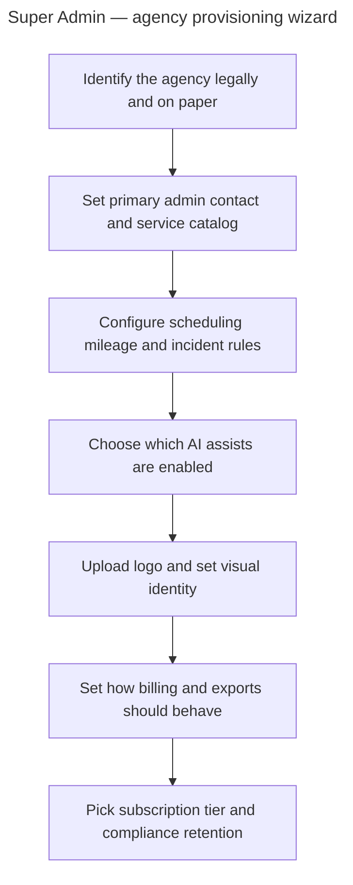

---

## 5. Client onboarding (add / edit client)

**Purpose:** Register or update a service recipient under an agency (Super Admin may pick the agency).

**Seven stages:**

1. Identity and contact (optional agency selection for Super Admin)
2. Guardian and funding
3. Healthcare and documents
4. EVV and visit configuration
5. Staff assignment and restrictions
6. Goals and emergency information
7. System AI and audit preferences

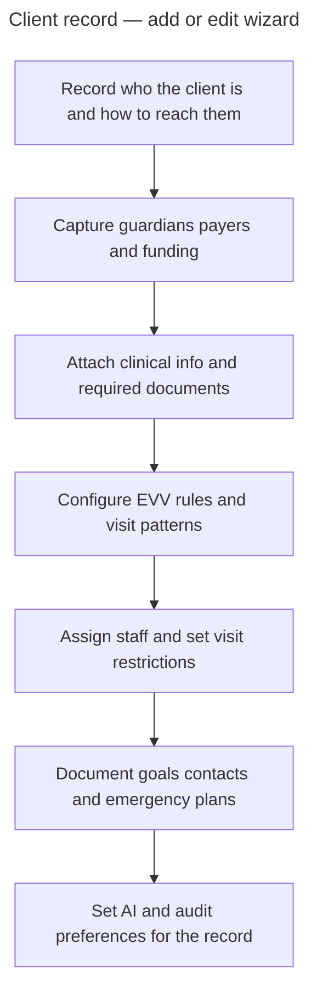

---

## 6. Agency-side applicant hiring (directory and profile)

Agency staff use **lists** and a **per-applicant profile** with tabs. **Actions** below are what the current UI emphasizes.

### A. Directory lists

- Browse all applicants, pending, and clearance or hiring views; search; on clearance, filter by today, week, or month.
- Open an applicant profile.
- **Clearance queue:** **Approve for hire** or **Reject clearance** per row (with reason on reject).

### B. Profile tab

- Read applicant info; optional **chat** when messaging is available.

### C. Documents tab

- Per document: **View**, **Accept**, or **Reject** (reject requires a reason); **Request document** if missing.
- **Send conditional hire advance** when every required document is uploaded and accepted and **two references** exist; confirmation dialog first.

### D. Conditional hire tab

- See whether the conditional letter is signed; view signature.
- Per compliance authorization: **Send alert** if the applicant has not yet approved that row.

### E. Final agency review tab

Seven checklist rows; each **Confirm** or **Reject** (reject with reason): documents valid; background check; drug test; fingerprint; trainings; DDDS provider profile (PCS/SAMS); orientation scheduled.

### F. Official hire tab

Shows official-hire signature status and **View signature**. Additional agency buttons (send offer, request signature, confirm hire) may exist in logic but can be hidden depending on UI version.

### Agency hiring — flow diagram

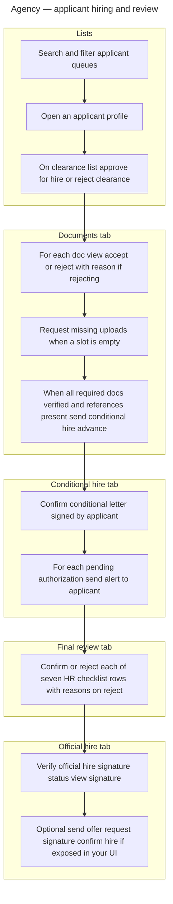

---

## 7. Agency shift creation (Add new Schedule)

**Where:** Agency **Scheduling** (shifts calendar area). User opens **Add new Schedule** (same modal is used for **Edit Schedule** with existing values).

**Outcome paths:** **Save** creates or updates shifts as **draft** (pending status, submitted draft). **Schedule** validates, creates one or many shifts as **available** and **submitted**, writes **employee activity log** rows, optionally creates a **goals document** linked to each new shift when a goals type was chosen, then shows success and closes.

### Every input in the modal (top to bottom)

1. **Client** — Search by name (min length before search); pick from results. Sets **client id** and pulls **service location** from the client record for the shift.
2. **Assign DSP** — Search by name for employees with **work availability**; pick from results. Sets **assigned DSP** display name and **employee id**.
3. **Service** — Dropdown of **services on the selected client** (disabled until a client is chosen). Shows optional **rate and pay type** hint for the selected service.
4. **Notes type** — One of: Community Based / Individual Supports; Community Inclusion activities log; Day Habilitation activities log; Prevocational Training activities log; Supported Employment intervention log; Supported Employment pre-employment log; Respite log.
5. **Goals type** — One of: Community Inclusion Services; Community Inclusion individualized goals; Day Habilitation Services; Day Habilitation individualized goals; Prevocational Training Services; Prevocational Training individualized goals; Natural Supports Training (or leave unselected).
6. **Scheduling type** — **One time** or **Recurring**.
7. **Dates (branch on type)**
   - **One time:** **Select date** (month calendar, single service day).
   - **Recurring:** **Select starting date**, **Select ending date**, then optional **Weekdays** toggles (Sat through Fri). If weekdays are used, for **each** selected day the user must set that day’s **clock in** and **clock out** before finishing weekday configuration; if **no** weekdays are selected, every day in the range uses the shared times below.
8. **Clock in time** — Preset chips (morning through early afternoon slots) **or** **Enter time** custom picker (12-hour display stored for the API).
9. **Clock out time** — Same pattern as clock in (presets plus custom).
10. **Selected weekdays summary** — Read-only chips listing each chosen weekday with its time range (recurring + weekdays only).
11. **ISP Outcome** — Read-only text populated from the client when available.
12. **Plan of care** — Read-only “no document” state, or **link to open** the client’s plan-of-care file when present; may show a selected file chip if the flow attached one.

**Footer actions:** **Save** (draft path) and **Schedule** (submit path). **Schedule** is disabled until validation passes (client, DSP, scheduling type, date rules, and clock times—including per-weekday times when weekdays are selected and no weekday row is mid-edit).

### Shift creation — input flow diagram

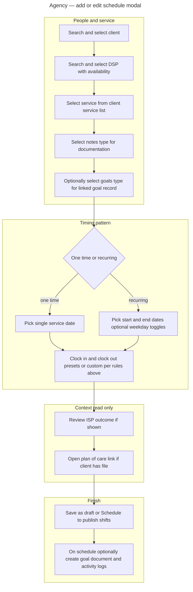

---

## 8. DSP when a shift is assigned (user panel shift management)

**Context:** After the agency **schedules** a shift for a worker, that shift is tied to the **DSP’s employee profile** and agency. The DSP uses the **employee (user panel)** experience—not the agency scheduling screens—to see it and to **clock in** and **clock out**.

**Where:** **Shift Management** on the user panel (home area for caregivers). A separate **Manual Timesheet** entry goes to a different flow for self-entered manual shifts; this section is about **assigned** automatic shifts.

### What the DSP sees first

- The page loads **all shifts** for the signed-in employee and agency (with client details).
- Shifts are grouped into **Current shift** (today, status available or ongoing—one primary “today” card), **Upcoming shifts** (future dates, or later today before start; draft or pending today items can appear here), and **Previous shifts** (completed, expired, or past end time).
- Each card shows **client**, **date** where relevant, **location** (often the client address), **scheduled start** (or actual clock-in time once started), and status chips such as **Starts in …**, **Ongoing**, **Time remaining**, **Expiring soon** (late in the window), or **Expired** (missed clock-in within the grace window after start, or past end without finishing—aligned with client-side rules).

### Location (required for clock actions)

- On load, the app requests **browser geolocation** and shows a human-readable **current location** line (reverse geocode when possible).
- If permission is denied, unavailable, or unsupported, **Clock In** and **Clock Out** are blocked with an error toast until location works.

### Clock in (assigned shift)

1. DSP taps **Clock In** on the **current** shift card (only when the server marks the next action as clock-in and the shift is not treated as expired).
2. The app checks GPS coordinates exist, then checks the device is within a **short geofence** of the shift’s coordinates (on the order of a few hundred feet of the service location). If not, a **location mismatch** dialog shows distance vs. expected site.
3. If within range, a **confirmation modal** asks to clock in; on **Yes**, the app sends latitude and longitude to the server; on success the shift refreshes as **ongoing** and a success message appears.

### During the shift

- The **current shift** card can show **time remaining** until the scheduled end (updated on a timer).
- **Expiring soon** may appear when most of the scheduled window has elapsed and the worker is still eligible to clock in (edge case for late arrival).

### Clock out

1. When the next action is **Clock Out**, the same **GPS + geofence** checks run as for clock-in.
2. **Confirmation modal** for clock out; on confirm, latitude and longitude are sent to the server.
3. On success the shift typically moves to **history**, the “current” slot clears, and lists reload.

### After the visit

- **Previous shifts** lists past work for review; those cards are informational (no clock buttons in the default layout).

### DSP assigned shift — flow diagram

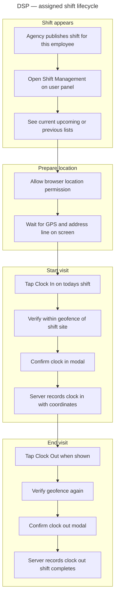

**If something blocks the flow:** no GPS or permission denied → toast, no clock buttons effective; outside geofence → mismatch dialog with distance; missed start grace without clock-in → card can show **Expired** and hide clock-in.

---

## 9. DSP documentation notes (activity logs)

**Context:** When an agency schedules work and ties **documentation** to that service (see agency shift flow—notes type for documentation), the system creates **activity logs** for the assigned **DSP (employee)**. The worker completes structured **Notes** forms in the **user panel**, not on the agency scheduling screens.

**Where:** **Notes** in the employee home area. The hub loads **all activity logs** for the signed-in worker; each item is a card showing **client name**, **created date**, and a **service-style title** (for example community based supports, day habilitation, respite log, supported employment variants). **Fill Now** opens the correct **template** for that log’s type, with the log id in the URL query string.

### Hub behavior

- If there are **no** logs yet, the grid is empty after loading.
- Cards are **disabled** (not navigable) when there is no log id—normally every listed log has an id.

### Detail form (pattern varies by template)

- **Header:** Often read-only **individual name**, **service code**, **service plan year**, **ISP outcome**, and jurisdiction boilerplate where the template requires it.
- **Log-level fields:** Some forms use **checkboxes or patches** (for example **service strategies**) that save to the **activity log** record as the worker toggles them.
- **Row-based visit entries:** Tables for **date**, **start and end time**, **activity or intervention fields**, and free-text or structured **description** columns. Field names and row counts depend on the **activity type** (community based table differs from respite, supported employment, and so on).
- **Saving rows:** When a row has the **minimum fields** the template requires (typically **date** plus **start and end times**), the app sends an **upsert** for that **note row** under the activity log; further edits to the same row update the server row once it has an id.
- **Submit:** A **submit** action sends the ids of the **note rows** to finalize documentation for that log; success shows a confirmation toast and the UI may reset row state per the template. Errors surface as toast messages.
- **Voice:** Pages that wrap the form in the **voice recording** context may offer **voice input** for dictation-style entry where the template includes it.
- **Back:** Returns to the **Notes** hub list.

### Agency overlap (read only for this section)

After a worker **submits**, agency staff may open the same logical documentation in **agency notes** views for review or correction workflows; that is a separate role path from the DSP **fill and submit** path above.

### DSP notes — flow diagram

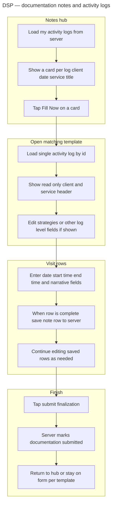

**If something blocks the flow:** missing or invalid **id** in the URL → detail query is skipped and the form does not load correctly; **submit** failure → error toast with server message when available; **network** errors on row save → logged or toasted depending on template.

---

## 10. Agency reports and billing

Two complementary areas: **operational billing lists** (review and drill into claims) and **structured reports** (pick a report category, set filters, open the matching report experience).

### A. Generate Report (reports hub)

**Purpose:** One **Report** entry point with **Generate Report** controls.

1. **Select report** — Choose among **Clients**, **DSPs**, **Shifts**, **Notes**, **Mileage**, **Expenses**, **Billing**, **Incidents**, and **Community Inclusions**.
2. **Filters** — Depend on the selection (examples: **active or inactive** for client and DSP directories; **shift status** presets for shifts; **note documentation type** when the report is notes; **mileage or expense status** buckets; **billing status** including pending, approved, and paid for the billing report type; **incident resolution** states; date **start and end** with an optional **lifetime** mode that ignores the date window).
3. **Generate** — After a short in-app **generating** state, the app stores filter choices for the session and navigates to the **dedicated report screen** for that category (each category has its own list or table behavior).

Downstream report screens apply those filters when loading data (for example date range may be read from navigation state when opening the **billing** report variant).

### B. Billing and Management (operational billing)

**Purpose:** **Billing and Management** — paginated **billing records** for the agency without going through the generic report wizard first.

- **View mode:** Toggle **Client** vs **DSP** grouping (list is keyed to clients with nested DSP rows, or to DSPs with nested client rows, depending on the tab).
- **Filters:** **Billing status** (all, pending, approved, rejected), **date** presets (all, today, this week, this month), and **service type** (for example companion, personal, respite care).
- **Each row** summarizes **who** (client and DSP), **service code**, **total hours**, and **pay rate** (rate labels can reflect the client’s configured service when applicable).
- **Generate Report** on a row opens the **Client Claims** detail for that client, or **DSP claims** detail for that worker, according to the active tab.

### C. Billing report screen (under Reports)

When the user arrives from **Generate Report** with report type **Billing**, they see a **billing-oriented** table (again with **Client** vs **DSP** tabs and pagination) backed by the same class of **billing records** query. Optional **date range** pickers and **search** refine the list. **Generate Report** on a row again navigates to **Client Claims** or **DSP claims** for the selected entity. Filter state from the hub can pre-fill **date range** when not in lifetime mode.

### D. Client Claims (detail)

- Opens for a specific **client** identifier from the billing list.
- Loads **client profile**, **service logs** grouped for display, and a **billing summary**.
- **Service hours** table: staff, service code, hours, rate label, line amount (amounts derive from client service rate rules and logged hours or units).
- **Download PDF** renders the printable claim layout and saves a PDF via the browser (client name and date in the filename pattern).
- **Back** returns using browser history (typically to the billing or report list).

### E. DSP Claims (detail)

- Opens for a specific **DSP** identifier.
- Shows **DSP-centric** billing: services grouped with clients, **billing summary**, and related **expense** rows where the product supports them.
- Staff may **approve** or **reject** individual **pending expenses** from this view, with success or error toasts.
- **Download PDF** is available for the claims-style printable content where implemented.

### Agency reports and billing — flow diagram

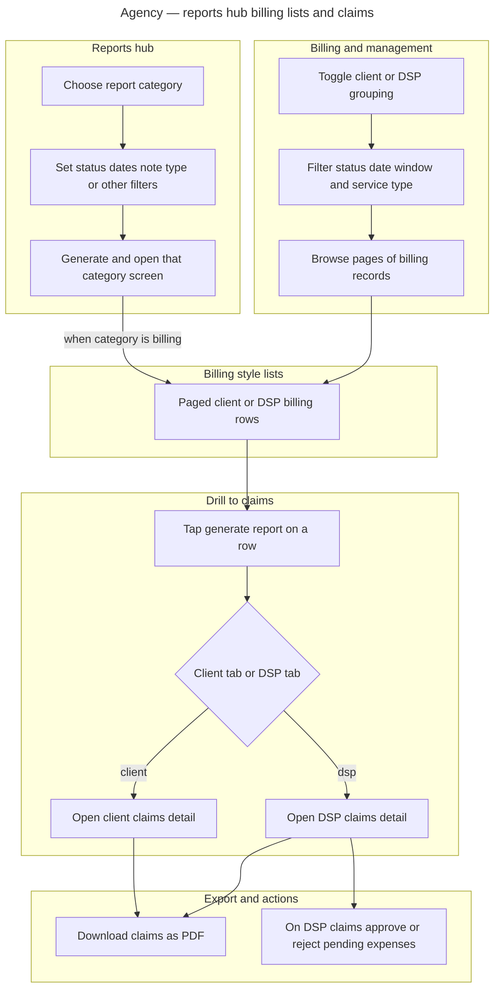

**If something blocks the flow:** **agency id** missing → billing queries are skipped and lists stay empty; **claims** request failure → error screen with back to billing; **PDF** generation failure → error is logged and the button state resets; **expense** approve or reject failure → destructive toast with server message when available.

---

## 11. Agency staff management (Team)

**Context:** Agencies invite **dashboard staff** (agency_staff accounts) who log in with their own credentials and see only the agency areas their **access list** allows. This is separate from **DSP Management**, which is the operational roster of **caregivers** who use the employee app.

**Where:** **Agency Settings**, **Team** tab (the UI label is **Team**; it governs internal **user levels** / permissions).

### Who can open Team

- **Agency** (owner-style role): **Team** tab is always available next to Account and Notification.
- **Agency staff:** **Team** appears only when their profile **access list** includes **User Levels**. Otherwise they do not see this tab.

### Team members list

- On open, the app loads **team members** for the current agency from the server (paged list with a search string—typically **name or email**).
- Each row shows **avatar or initials**, **name**, **email**, **access** as chips, and **active** vs **inactive** state (inactive members can be **activated** again from the row).
- **Empty state** invites adding the first team member.
- **Load failure** shows an inline error message to retry.

### Add or edit a team member

- **Add team member** opens a modal to enter **name**, **email**, **password** (with optional generated password), **phone**, and a multi-select **access list**.
- **Access** options align with main agency nav and tools—for example **DSP Management**, **Client Management**, **Shift Management** (scheduling), **Notes**, **Billing and Management**, **AI Automation**, **Support**, **Analytics**, **Goals and Documents**, **Applicant Directory**, **Reports**, **Community Inclusion**, **Trainings**, **User Levels** (so a staff member can delegate team admin), **Mileage**, and **Incident**. The saved payload maps **Shift Management** to the scheduling scope the API expects.
- **Create** provisions the account; success explains they can sign in with the email and password supplied. Errors toast from the server.
- **Edit** reopens the same modal with existing fields; updates typically send **name**, **phone**, **access list**, and **password** only if changed.

### Ongoing administration (per row)

- **Reset password** — After confirmation, the server triggers a **password reset** flow (for example email link); success or failure is toasted.
- **Deactivate** or **Activate** — Toggles whether the staff account is **active** without deleting it.
- **Delete** — Permanent removal after a **confirm** dialog; success removes them from the roster.

### Relationship to other settings tabs

- **Account** and **Notification** tabs are personal settings for the signed-in user and do not change other staff.
- Caregiver hiring and profiles remain under **DSP Management** and applicant flows, not under **Team**.

### Agency staff Team — flow diagram

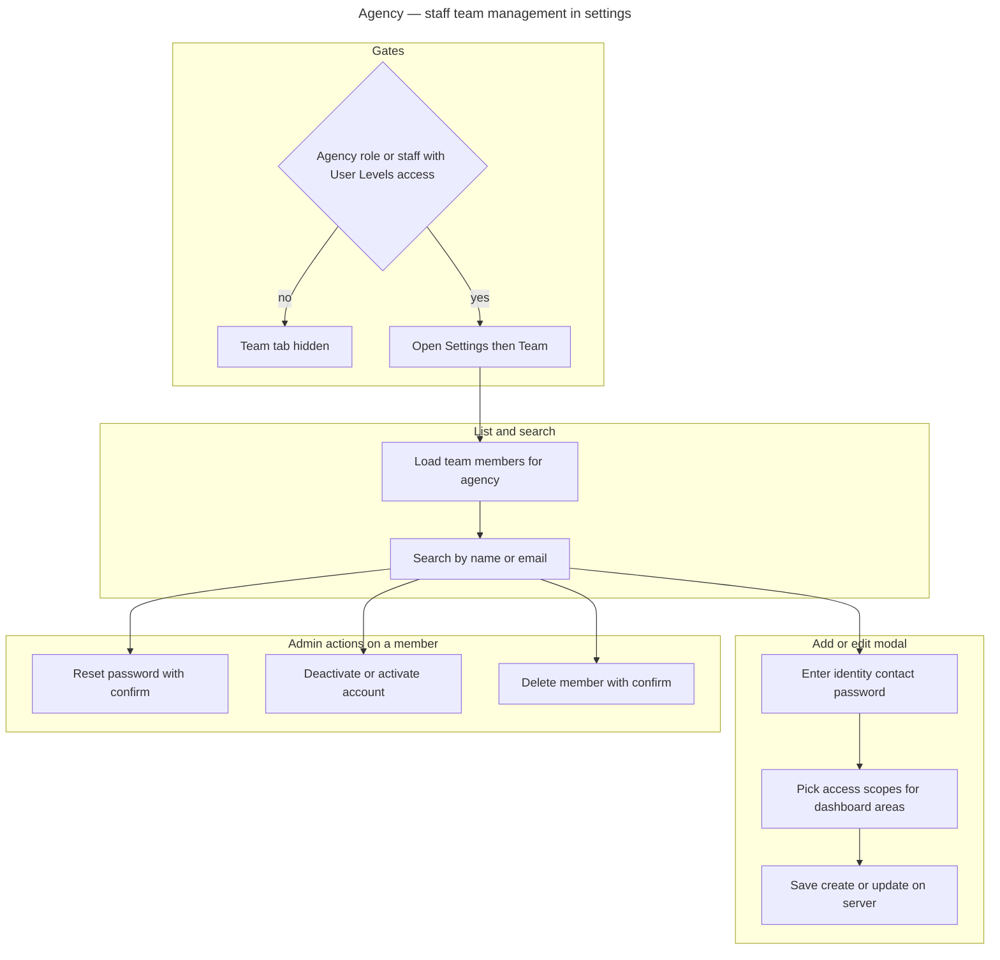

**If something blocks the flow:** **list** API error → inline error, no rows; **create or update** validation or server rejection → destructive toast, modal stays open for correction; **delete or password reset** failure → toast with server message when available.

---

## 12. DSP Management (caregiver roster)

**Context:** **DSP Management** is the agency’s roster of **employed caregivers** (employees) who deliver services and use the **user panel**. It is separate from the **Applicants Directory** (candidates not yet hired) and from **Team** (§11 dashboard staff).

**Where:** Main agency navigation **DSP Management**.

### List and filters

- The page loads **DSP overview** counts: **active**, **inactive** (includes suspended and pending in the inactive bucket for filtering), and **total**.
- **Search** narrows the table by name (with optional quick suggestions while typing).
- **Status** filter: **active**, **inactive**, or **all**; results are **paginated** client-side in fixed page sizes.
- Load failures show an error state instead of the table.

### Profile drill-down

- Choosing a DSP opens their **profile**, loaded from the employee record: identity, contact, address, hire-related dates, **status** (active, inactive, pending, suspended), avatar, and downstream tabs (for example shifts and activity) for operational review.

### DSP roster — flow diagram

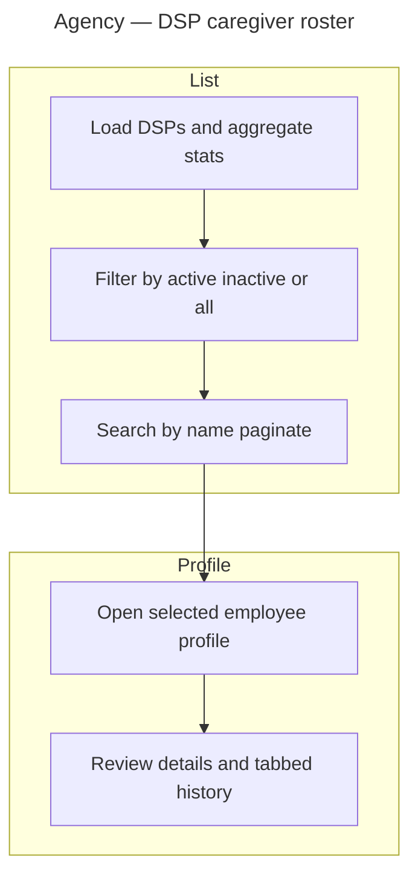

**If something blocks the flow:** roster **fetch** error → full-page error message; missing **profile id** → user is sent back to the roster.

---

## 13. Agency scheduling operations (lists, activity, approvals)

**Context:** Beyond creating or editing a single schedule (§7), agencies operate **shift lists**, an **activity** view for exceptions and follow-up, and **approvals** for completed work that must be signed off.

### Shift list (shift management hub)

- Loads **shifts** for the agency with client and employee context; **draft manual timesheets** are typically hidden from this list.
- **Month calendar** and **date** selection help focus on a service day; **search** and **pagination** organize long lists.
- Actions include **add schedule** (opens the same style of scheduling modal as §7) in **create** mode, **edit** on an existing shift, **cancel** with confirmation, and—where the product allows—**approve** a shift inline when policy requires it.
- Success and error feedback use **toasts** or confirmation modals depending on the action.

### Activity logs

- Presents shifts with **health-style filters**: all, **active**, **completed**, **missed**, **incomplete**, derived from clock state and calendar rules.
- Staff can open a **shift details** modal, see **anomaly hints** when the engine flags timing issues, and launch **add or adjust schedule** when corrections are needed.

### Approvals (completed shifts)

- Loads **completed** shifts for the agency, then splits them by whether they are already **approved** versus **pending approval** (toggle often labeled active vs inactive in the UI).
- **Search** matches client, DSP, or location text.
- For each pending row, **approve** sets the shift’s approved flag through the API and shows a **success** summary; **reject** uses a parallel flow (for example cancel or deny—confirm in UI copy).
- Pagination applies to the filtered set.

### Scheduling operations — flow diagram

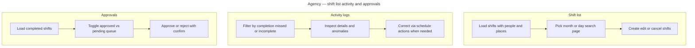

**If something blocks the flow:** missing **agency** context → fetches are skipped or show errors; **list** failures → toast and empty table; **approve or reject** API errors → destructive toast and modal cleanup.

---

## 14. Agency Notes (review DSP documentation)

**Context:** After DSPs **submit** activity-log style documentation (§9), agency users with **Notes** access review submissions here. This is the **agency** mirror of worker-side notes—not the same screen as the employee **Notes** hub.

**Where:** Agency navigation **Notes**.

### Inbox and filters

- **Status tabs** switch between **submitted** (awaiting review) and **approved** history (rejected items follow product rules for visibility).
- **Documentation type** chips filter by template family (community based, community inclusion, day habilitation, prevocational, respite, supported employment variants, or **all**).
- **Time** presets (all, today, this month, this year) and **debounced search** refine the server-backed **paginated** list.

### Review actions

- From a row, staff can **approve** or **reject** a submission id; failures surface as **alerts** or console errors depending on the path.
- Opening a specific submission via **query id** enters **view mode** with the detailed template (read-heavy or editable depending on status—submitted vs approved forms mirror agency template behavior in §9’s agency overlap).

### Agency Notes — flow diagram

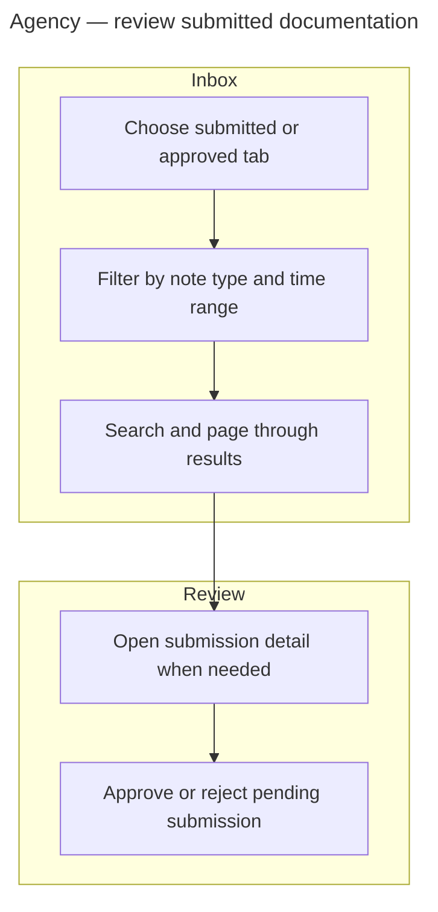

**If something blocks the flow:** missing **agency id** → query skipped; **approve or reject** failure → user-visible error without silent success.

---

## 15. Goals and Documents

**Context:** Agencies maintain **service-specific goal packets and annual updates** distinct from per-visit **Notes** (§9 / §14). The hub is organized by **document program type**.

**Where:** Agency navigation **Goals and Documents**.

### Hub and catalog list

- The landing page shows **cards** for each supported program—for example **community inclusion** individualized goals and annual update, **day habilitation** and **prevocational** variants, and **natural supports training**.
- **View all documents** opens a **filterable list** (status and document type) of saved goal documents for the agency; choosing a row navigates to the correct **editor route** with identifiers so the right template loads (including return-from-list behavior).

### Per-document flows

- Each deep link template supports entering or updating structured fields per regulatory layout (details mirror the specific form: client metadata, goals tables, signatures, and submission states such as draft vs submitted—exact fields vary by card).

### Goals and Documents — flow diagram

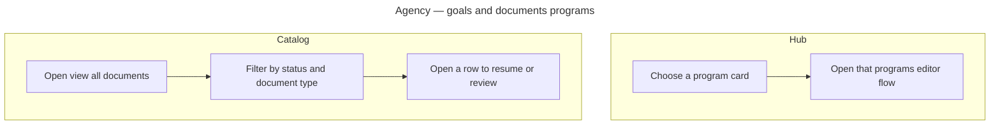

**If something blocks the flow:** **catalog** query errors → empty or error UI; unknown **document type** mapping → navigation may not resolve to an editor.

---

## 16. Mileage (DSP and agency)

**Context:** **Mileage** captures reimbursable or billable **rides** and travel segments. Workers log and progress their own trips; agency staff maintain an agency-wide ride list for oversight and corrections.

### DSP (user panel)

- Loads the signed-in worker’s **rides** and a **total mileage** summary when the API provides it.
- Surfaces **current** ride (for example in progress) and **upcoming** rides when statuses exist; ride components drive **start**, **progress**, and **completion** style actions against the worker mileage API.
- **List refresh** after actions keeps cards in sync with the server.

### Agency

- **Mileage** lists **agency-scoped** rides (paginated or limited batches depending on API defaults).
- Staff can **add** a ride via modal, **edit** an existing ride, **delete** with confirmation, or **cancel** a ride where the product supports cancellation; the list **refetches** after successful mutations.

### Mileage — flow diagram

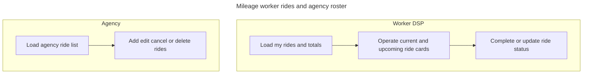

**If something blocks the flow:** **load** errors → toast or inline error, empty rides; **mutation** failures → console or toast depending on path; **delete or cancel** confirmation abandoned → no server change.

---

## 17. Expenses (DSP submit and agency approval)

**Context:** Workers submit **reimbursement requests** with receipts; agency finance or billing staff **approve** or **reject** them in the claims context tied to billing (§10).

### DSP (user panel)

- **Expenses** page: enter **amount**, **category**, **date**, **description**, and attach a **receipt** file.
- **Validation:** allowed types (common image formats and PDF), **maximum file size**, positive **amount**, non-empty **category**—otherwise submit is blocked with toasts.
- **Submit** uploads the receipt then creates the expense record via the API.

### Agency

- Pending expenses surface on **DSP claims** (and related billing surfaces in §10).
- **Approve** or **reject** calls the expense mutations with **agency id**; success and failure use **toasts**.

### Expenses — flow diagram

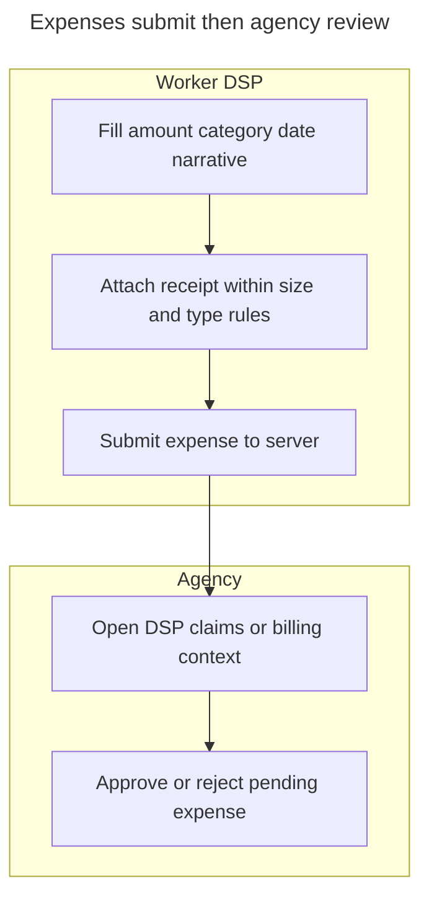

**If something blocks the flow:** missing or invalid **receipt** → toast, no submit; **upload** failure → error toast; **approve or reject** API error → destructive toast with server message when available.

---

## 18. Incidents (DSP report and agency inbox)

**Context:** **Incidents** document safety or clinical events. Workers **file** structured reports; agency staff **review** a consolidated inbox and update disposition.

### DSP (user panel)

- **Incident** form: **search clients** by name with debounced queries (minimum length before search fires); select **client**, pick **date** and **time**, then complete narrative blocks (**what happened**, **actions taken**, **what you did next**, optional **witness**).
- **Submit** sends the payload to the incident API; errors should surface in the UI path used by the page.

### Agency

- **Incident** page loads **paginated** incidents for the agency; **refresh** reloads the current page.
- Rows may fetch **full client** records when only ids are present so names display consistently.
- **Detail modal** opens for a selected report; staff work through **status** transitions supported by the API (for example under review, resolved, not resolved—exact labels follow the product).

### Incidents — flow diagram

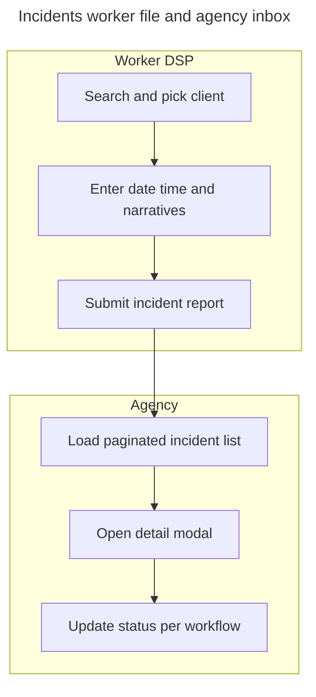

**If something blocks the flow:** **client search** errors or too-short query → empty results; missing **agency id** → list does not load; **pagination** at end → empty page with disabled next control; **modal** save failure → toast or inline error per implementation.

---
