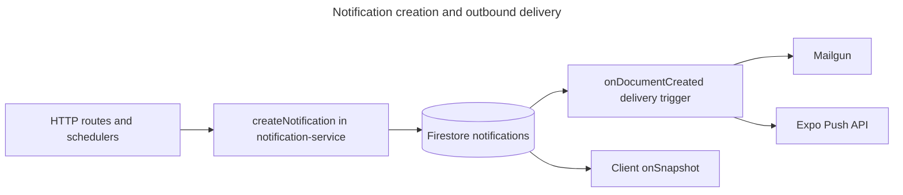

# Notifications, email delivery, push, and compliance expiry

## Overview

Care On Board creates **in-app notification records** in Firestore, sends **email** for many notification types (via **Mailgun**), and sends **mobile push** to devices that register an **Expo push token**. **Compliance and certification reminders** are driven by **scheduled** Cloud Functions so expiring or expired items are surfaced on a daily cadence without spamming the same person every run.

**Audience:** Engineers, DevOps, security reviewers, and technical staff who need to operate, test, or extend notification delivery, compliance scanning, and related data fields.

**Repositories:**

- **Backend:** `CareOnBoard-BackEnd` (Firebase Cloud Functions, Firestore Admin, Mailgun, Expo Push API)
- **Frontend:** `Care-On-Board` (real-time in-app list via Firestore `onSnapshot`; no REST body for the notification document is required for basic UX)

This document is **thorough** on backend behavior. For end-user product flows across the app, see **`docs/care-on-board-workflow-guide.md`**. For high-level “rules” copy, see **`docs/system-rules-and-validation-logic.md`** (Messages and notifications section).

---

## Table of contents

1. [What the user experiences](#1-what-the-user-experiences)
2. [Architecture (high level)](#2-architecture-high-level)
3. [In-app notifications (web / open sessions)](#3-in-app-notifications-web--open-sessions)
4. [Notification creation and validation](#4-notification-creation-and-validation)
5. [Outbound email and push (delivery trigger)](#5-outbound-email-and-push-delivery-trigger)
6. [Compliance: expiring documents (scheduled)](#6-compliance-expiring-documents-scheduled)
7. [Certification renewal reminders (scheduled)](#7-certification-renewal-reminders-scheduled)
8. [Wired “event” notifications (product hooks)](#8-wired-event-notifications-product-hooks)
9. [Security and hardening](#9-security-and-hardening)
10. [Configuration, secrets, and parameters](#10-configuration-secrets-and-parameters)
11. [Operations: deploy, indexes, and logs](#11-operations-deploy-indexes-and-logs)
12. [Manual testing](#12-manual-testing)
13. [Troubleshooting](#13-troubleshooting)
14. [Key source files (reference)](#14-key-source-files-reference)
15. [Document history](#15-document-history)

---

## 1. What the user experiences

- **In-app:** Users see new items in a notifications list when the app is open and subscribed to their `notifications` query (per-user documents).
- **Email:** If their profile allows email notifications and the **notification type** is configured to send email by default, they receive a templated **HTML and plain text** message via **Mailgun** after a new Firestore notification document is created (delivery is **not** inline inside every HTTP handler—it runs in a **single Firestore trigger** so Mailgun secrets bind once).
- **Push:** If a **valid Expo push token** is stored on the user profile, the backend sends a **minimal** data payload to Expo (no PII in the push `data` field; the app can load full detail after the user opens the app).
- **Expiry / compliance:** Agency staff and employees may get scheduled reminders for documents approaching expiry, expired documents, and certification windows, subject to **deduplication** rules so the same milestone is not re-notified on every daily run.

There is **no** separate public REST OpenAPI description for the full notification document shape in this repo; preferences are documented under `userProfile` in **`functions/swagger-spec.js`**. The **Firestore document** fields described below are for engineering and support.

---

## 2. Architecture (high level)

| Step | What happens |
|------|----------------|
| 1 | Callers (routes, schedulers, helpers) use **`createNotificationService(db).createNotification(...)`** (or `createBulkNotifications`, which loops `createNotification` per recipient). |
| 2 | A new document is written to **`notifications`** with **`deliveredVia`** flags that **queue** email and/or push (when applicable). |
| 3 | **`notificationDeliveryTrigger`** runs on create, re-reads the doc, loads **`users/{uid}`**, and sends **email** and/or **Expo push**, then updates **`deliveredVia`**. |
| 4 | The web app listens to the user’s notifications and shows updates in near real time. |

---

## 3. In-app notifications (web / open sessions)

- The React app (e.g. `useNotifications` or equivalent) subscribes to Firestore with **`onSnapshot`** for the current user’s notification query.
- **No** change to this pattern was required for email/push: delivery is asynchronous on the **same document** the client already subscribes to; optional fields on `deliveredVia` may update after the first render.

---

## 4. Notification creation and validation

**Service:** `functions/services/notification-service.js`

- **Joi** validates payloads against **`createNotificationSchema`** in `functions/schemas/notification.schema.js` (title/message limits, `type` enum, relative `actionUrl`, etc.) with **`stripUnknown: true`**.
- **User document required:** If **`users/{uid}`** does not exist, creation returns **`null`** (no document written). This prevents orphan notifications for invalid UIDs.
- **Channel preferences:** Respects `users.notifications` (`emailNotifications`, `inAppNotifications`) combined with per-type **`NotificationConfig[type].emailByDefault`**. If both in-app and email are effectively off, creation returns `null`.
- **Optional `forceChannels`:** Can override the above for special cases.
- **Rate limit:** At most **10** notifications per **uid + type** per **rolling hour** (query on `notifications` with `createdAt`); if exceeded, returns `null` and logs a warning.
- **Bulk create:** `createBulkNotifications` loops **`createNotification`** per recipient (same validation, preferences, and rate limits apply per user).

**Firestore collection name:** `notifications` (see `COLLECTION_NAME` in the schema module).

**Typical `deliveredVia` shape on create** (simplified; exact fields are set in code):

| Field | Role |
|-------|------|
| `inApp` | Whether the notification should appear in-app. |
| `email` | Legacy-style flag; outbound email status is also tracked in **`emailStatus`**. |
| `emailStatus` | `pending` (send), `skipped`, or later updated by the trigger. |
| `pushStatus` | `pending` (attempt push if token exists) or `skipped` from bulk paths where push is not queued. |
| `emailSentAt` / `pushSentAt` | Set when a channel successfully completes (see trigger). |

---

## 5. Outbound email and push (delivery trigger)

**File:** `functions/triggers/notification-delivery-trigger.js`  
**Export:** `notificationDeliveryTrigger` (see `functions/index.js`).

### 5.1 Why a trigger instead of sending inside every route

- **Mailgun** needs **`MAILGUN_API_KEY`** (secret). Binding that secret to **one** Firestore function avoids duplicating secret configuration across many HTTP `onRequest` functions.

### 5.2 Idempotency and state machine

- The trigger **re-fetches** the notification document (the create-event payload can be **stale** on at-least-once retries).
- **Email** and **push** each use a **transaction** to move status from **`pending` → `sending`** so parallel invocations do not double-send.
- If the function **crashes** after claiming `sending` but before completion, a later run can reclaim a **stale** `sending` if **`updatedAt`** is older than **5 minutes** (`STALE_CLAIM_MS`).

**Documented `deliveredVia` email/push status flow:**

- `pending` → `sending` → `sent` | `failed` | `skipped`
- **Retryable** failures (e.g. transient HTTP / vendor errors) may reset status to **`pending`** so a future **reconciliation** job or operator action can retry; **non-retryable** errors become **`failed`**.

**Early exits** (no user, unknown type, missing fields) call **`markSkipped`**, which sets both channels to **`skipped`** and writes **`deliveredVia.skipReason`** (e.g. `user_missing`, `unknown_type`, `missing_fields`).

### 5.3 Email

- **Template:** `functions/utils/email-templates/notification-template.js` (`generateNotificationEmail`).
- **HTML escaping** is applied to user-controlled strings in HTML bodies (XSS hardening; see [Security](#9-security-and-hardening)).
- **Mailgun** implementation: `functions/services/email-service.js` — **`sendNotificationEmailMailgun`** returns success or `{ ok: false, retryable }` so the trigger can distinguish terminal vs retryable.

### 5.4 Push (Expo)

- **File:** `functions/services/push-service.js` — **`sendExpoPush`**
- **Endpoint:** `https://exp.host/--/api/v2/push/send`
- **Token validation:** Expects `ExponentPushToken[...]` or `ExpoPushToken[...]` form.
- **Payload:** Only minimal keys (e.g. `notificationId`, `type`, truncated `actionUrl`); not the full Firestore `payload` object.
- **Invalid device:** `DeviceNotRegistered` (and similar) clears **`expoPushToken`** on the user document so the backend stops retrying dead tokens.

---

## 6. Compliance: expiring documents (scheduled)

**File:** `functions/scheduled/compliance-alerts.js`  
**Exported Cloud Function name:** `complianceAlerts` (see `functions/index.js`).

**Schedule (typical):** Daily **8:00** America/New_York (see source file for exact `onSchedule` options).

**Behavior (high level):**

- Queries **`documents`** with `expiryDate` within a look-ahead window.
- Resolves **employee** and **agency** context from **`employees/{employeeId}`** (cached in-memory for the run).
- For each milestone (**30d**, **7d**, **expired**), uses **`createNotification`** and maintains **`lastNotifiedMilestone`** on the **document** so the **same** milestone is not notified every day indefinitely.

**Deduplication field (documents):**

| Field | Values |
|-------|--------|
| `lastNotifiedMilestone` | `"30d"` \| `"7d"` \| `"expired"` (or unset / `null` before any notify) |
| `complianceUpdatedAt` | Server timestamp when the scheduler updates milestone fields (separate from generic `updatedAt` on the document, if present, to avoid conflating “user edited” with “compliance system touched”). |

**Expired + agency admins:** The **expired** path **marks the milestone first**, then creates the **employee** notification, then **fans out to agency** users (`userType: agency` for that `agencyId`). This ordering prevents **admin** duplicate spam when the **employee** `createNotification` returns `null` (e.g. rate limit) while the employee notification did not.

**7d / 30d:** Milestone is written **only when** `createNotification` returns a **non-null** result (avoids marking milestone without a successful in-app/queued notification for those windows).

---

## 7. Certification renewal reminders (scheduled)

**File:** `functions/scheduled/compliance-alerts.js`  
**Exported Cloud Function name:** `certificationRenewalAlerts` (see `functions/index.js`). **Schedule:** separate from document compliance (typically **9:00** America/New_York — verify in source).

**Behavior:**

- Iterates employees with **`certifications`**, evaluates expiration vs **now** and a **30-day** window.
- Avoids **Firestore dot-path bugs** for certification keys that contain **`.`** or other special characters: updates use **`FieldPath("certifications", certType, ...)`** instead of `certifications.${certType}`.
- **Dedup / renewal after date change:** Stores **`renewalNotifiedForExpiryMs`** (epoch ms of the expiration we notified for). If the same certification gets a **new** expiration, the value no longer matches and a **new** reminder can fire. **Legacy** rows with **`renewalNotifiedAt`** but **no** `renewalNotifiedForExpiryMs` are treated as one-shot to avoid a sudden flood of duplicate notifications on deploy.

---

## 8. Wired “event” notifications (product hooks)

These helpers live in `functions/utils/notification-helper.js` and are **invoked from** routes/controllers or schedulers when the corresponding business event occurs. Examples (non-exhaustive; verify in code):

| Area | Event (concept) | Example integration |
|------|-------------------|----------------------|
| Employee documents | Upload / update in user panel | `functions/controllers/user-panel/documents.js` |
| Client care / DSP | Assign caregiver, plan of care | `functions/controllers/clients.js` |
| Mileage (rides) | Ride completed (stop) | `functions/routes/user-panel-routes/mileage.js` |
| Applicants | Approve for official hire (agency) | `functions/routes/agency-routes/agency-applicants.js` (uses `getAgencyAdminUids` + `notifyApplicantApproved`) |

**Agency approvers** for some flows are resolved with **`getAgencyAdminUids(db, agencyId)`** (`users` with `agencyId` and `userType` in `agency` / `agency_staff`).

### Shift no-clock-in expiry window

**File:** `functions/scheduled/shift-reminders.js`  
**Exported Cloud Function name:** `lateClockInAlerts`

- Runs every **10 minutes** and checks today’s assigned shifts with `status` in **`pending` / `available`** so notifications do not depend on someone calling `GET /shifts` first.
- The no-clock-in warning window starts **after the 15-minute grace period** and ends at the **60-minute hard no-show cutoff**.
- **DSP notification:** sends `SHIFT_LATE_CLOCK_IN` once per shift using `lateAlertSent` / `lateAlertSentAt`. This path forces **in-app + email** with `forceChannels: { inApp: true, email: true }`; Expo push is attempted by the delivery trigger when `users/{uid}.expoPushToken` exists.
- **Agency notification:** sends `SHIFT_EXPIRING_NO_CLOCK_IN` once per shift to agency admins/staff resolved by `getAgencyAdminUids`. Dedup fields are `agencyExpiringNoClockInNotified` / `agencyExpiringNoClockInNotifiedAt`.
- If no agency admin notification document is created, the agency dedup flag is not set, allowing a later scheduler run to retry while the shift remains in the warning window.
- If a matching shift is still `pending` when a warning notification is created, the scheduler also persists `status: "available"` and `actionStatus: "clock_in"` so the status no longer relies on the shift list endpoint.

---

## 9. Security and hardening

| Topic | Implementation notes |
|-------|------------------------|
| **XSS in HTML email** | `escapeHtml` in `functions/utils/html-escape.js` used in notification, compliance, and billing email HTML templates. |
| **Input validation** | `createNotificationSchema` + Joi in `createNotification`. |
| **Idempotency** | Firestore delivery trigger uses claims + re-read; stale `sending` recovery. |
| **Push data minimization** | Only small, non-PII fields in Expo `data`. |
| **Logging** | Masked or structured logs in hot paths; `functions/utils/structured-log.js` for JSON lines in trigger and schedulers. |
| **Rate limiting** | Per uid + per type per hour in `createNotification`. |

**Firestore security rules** for `notifications` remain **server-only create**; clients typically **update** read/archive fields only, per your rules file.

---

## 10. Configuration, secrets, and parameters

| Name | Kind | Used for |
|------|------|----------|
| `MAILGUN_API_KEY` | **Secret** (`defineSecret`) | Mailgun API key on **`notificationDeliveryTrigger`**. |
| `MAILGUN_DOMAIN` | **String param** (`defineString`) | Mailgun domain (set via Firebase params / deployment workflow aligned with your other Mailgun call sites). |

**User profile (Firestore):** `users/{uid}.email`, `users/{uid}.notifications`, `users/{uid}.expoPushToken`.

**Node runtime:** see `CareOnBoard-BackEnd/functions/package.json` `engines` (e.g. Node 22) — global **`fetch`** is available for Expo HTTP calls.

---

## 11. Operations: deploy, indexes, and logs

- **Deploy** the `notificationDeliveryTrigger` and scheduled functions with the same Firebase project and region conventions as the rest of the codebase.
- **Composite index:** Notifications may use a **uid + type + createdAt** query for rate limiting — ensure `firestore.indexes.json` is deployed if you add or change that query.
- **Logs:** Search Cloud Logging for JSON payloads where **`msg`** matches e.g. `notification-delivery.*`, `compliance-alerts.*`, or plain stderr from `notification-service`.

---

## 12. Manual testing

**A. In-app and delivery (staging or emulator)**

1. Ensure **`users/{uid}`** exists with a valid **`email`** and (for push) a real **`expoPushToken`** from a dev device.
2. Drive any API flow that calls **`createNotification`**, or use **Admin SDK** in the emulator to add a `notifications` document consistent with the service output (if rules block client create).
3. Observe: Firestore **`deliveredVia`**, Cloud Logs (structured + text), **inbox** (Mailgun / sandbox allowlist), and **device** (Expo).
4. **Edge cases:** unknown `type` (expect `skipReason: unknown_type`), missing user doc (`user_missing`), invalid Expo token (expect token cleared and push failure / terminal as implemented).

**B. Schedulers**

- Invoke **`complianceAlerts`** / **`certificationRenewalAlerts`** via **`firebase functions:shell`** in a dev project, or run against staging after seeding `documents` / `employees` data.
- Run **twice** in a row: second run should **not** repeat the same **milestone** notifications for the same document (unless data changed).

**C. Rate limit**

- Create **more than 10** notifications for the same **`uid` + `type`** within an hour; expect `null` from `createNotification` and a warning in logs.

---

## 13. Troubleshooting

| Symptom | Things to check |
|---------|-----------------|
| Empty in-app bell / list despite API success | **`VITE_API_ENVIRONMENT`** vs Firestore client DB: API may write to **staging** while the web app listens on **(default)**. Align env vars (see frontend `src/lib/firebase.ts` and README). |
| No email at all | `MAILGUN_API_KEY` / `MAILGUN_DOMAIN` on the **trigger**; user **`email`**; `emailNotifications` off; `emailByDefault` false for that type. |
| Email stuck `pending` | Mailgun 5xx/timeout (retryable → may reset to `pending`); no **reconciliation** job to reprocess pending; trigger not deployed. |
| Duplicate emails | Unusual: claims should prevent double send; check for **multiple documents** with same event. |
| No push | Missing or wrong **`expoPushToken`** format; Expo errors in logs; token cleared after `DeviceNotRegistered`. |
| Stuck `sending` | Wait **5+ minutes** for stale reclaim, or fix doc manually; check for crashes in trigger. |
| Compliance repeats daily | `lastNotifiedMilestone` not set or not matching path; `complianceUpdatedAt` only for scheduler writes. |
| Cert key with dots | Must use `FieldPath` updates (see implementation); do not use raw dot strings in `update({ "certifications.foo.bar": ... })` for **dynamic** keys. |
| `createNotification` always null | No **user** doc; both channels off; **rate limit**; Joi validation error (throws). |
| Email/push missing on staging only | `notificationDeliveryTrigger` listens on Firestore **(default)**; notifications created in the **staging** DB do not trigger outbound delivery until staging-scoped triggers exist. |

---

## 14. Key source files (reference)

### Backend (`CareOnBoard-BackEnd` / `functions`)

| File | Role |
|------|------|
| `services/notification-service.js` | `createNotification`, `createBulkNotifications`, rate limit, prefs, Joi. |
| `schemas/notification.schema.js` | `NotificationType`, `NotificationConfig`, `createNotificationSchema`, collection name. |
| `triggers/notification-delivery-trigger.js` | Firestore onCreate: Mailgun + Expo, `deliveredVia` updates, `markSkipped`, stale claims. |
| `services/email-service.js` | `sendNotificationEmailMailgun` (and other Mailgun call sites for compliance/billing). |
| `services/push-service.js` | `sendExpoPush` to Expo HTTP API. |
| `utils/html-escape.js` | `escapeHtml`, `maskEmail`. |
| `utils/structured-log.js` | JSON line logging for schedulers and trigger. |
| `utils/notification-helper.js` | High-level `notify*` helpers; `getAgencyAdminUids`. |
| `scheduled/compliance-alerts.js` | `complianceAlerts`, `certificationRenewalAlerts`. |
| `index.js` | Exports `notificationDeliveryTrigger`, schedulers, HTTP functions. |
| `firestore.indexes.json` | Composite indexes (including rate-limit query if present). |

### Frontend (`Care-On-Board`)

| File / area | Role |
|-------------|------|
| `src/lib/hooks/useNotifications.ts` (or equivalent) | Real-time `notifications` subscription. |
| Settings / profile UI | `notifications` preference toggles stored on the user. |

**OpenAPI (Swagger):** `functions/swagger-spec.js` documents **`/userProfile/notifications`** (preferences), not the full Firestore notification **document** schema.

---

## 15. Document history

- **Initial version:** Documents in-app + Mailgun + Expo delivery architecture, `deliveredVia` state machine, compliance and certification schedulers, deduplication fields, security notes, config, testing, and troubleshooting, aligned with the `CareOnBoard-BackEnd` implementation in the feature branch that introduced the notification delivery trigger and related hardening.

For cross-cutting product context, see **`docs/care-on-board-workflow-guide.md`**. For other validation rules, see **`docs/system-rules-and-validation-logic.md`**.
